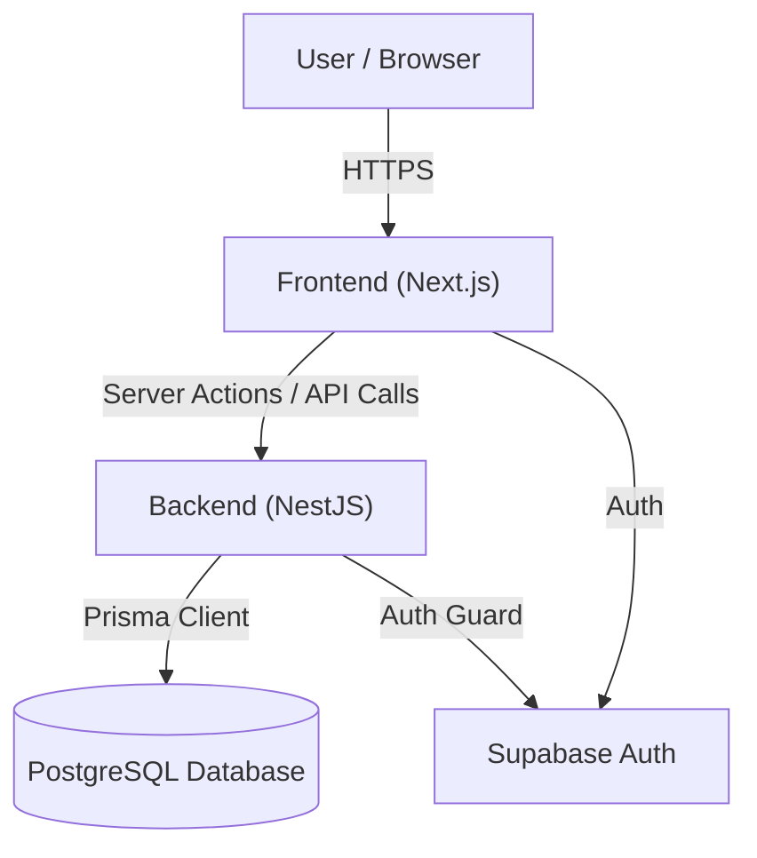

# Swan Swim Management - System Documentation

## 1. System Overview

Swan Swim Management is a monorepo application designed to manage swim school operations, including student enrollments, class scheduling, attendance tracking, and billing.

### Tech Stack

- **Monorepo Management**: Turborepo (v2.5.6)
- **Frontend (`apps/web`)**: 
  - Framework: Next.js 15.5.9 (App Router)
  - UI Library: Shadcn/UI (Radix Primitives + Tailwind CSS v4)
  - State Management: React Hooks
  - Authentication: Supabase Auth
  - Core Deps: `lucide-react`, `date-fns`, `react-hook-form`, `zod`
- **Backend (`apps/api`)**: 
  - Framework: NestJS 11
  - Language: TypeScript
  - API Style: RESTful
  - Validation: `nestjs-zod`
- **Database (`packages/db`)**:
  - Database: PostgreSQL
  - ORM: Prisma 7
- **Shared (`packages/shared-types`)**: Shared TypeScript interfaces between web and api.

## 2. Architecture & Data Flow

The system follows a classic 3-tier architecture.



### Data Flow Lifecycle

1.  **User Interaction**: A user interacts with the UI (e.g., viewing a student profile).
2.  **Frontend Request**:
    *   **Server Components**: Fetch data directly from backend APIs or DB (in some cases) during server-side rendering. Note: Some dynamic routes must force dynamic rendering to avoid build-time static generation errors.
    *   **Client Components**: Use `fetch` or custom hooks to call Next.js API routes or directly call the NestJS backend.
3.  **Backend Processing**:
    *   NestJS Controllers receive the request.
    *   Guards verify the JWT token (from Supabase) and checking user roles/permissions.
    *   Services execute business logic and interact with the database via Prisma.
4.  **Database Interaction**: Prisma executes SQL queries against PostgreSQL.
5.  **Response**: Data flows back up the chain to the user.

## 3. Key Modules

### Schedule Management
- **Core Entities**: `Term`, `ClassOffering`, `ClassSession`
- **Features**: 
  - Visual grid for scheduling (`StudentGrid`, `SlotBlock`)
  - Terms allow managing seasonal sessions.
  - Generates recurring `ClassSessions` for each `ClassOffering`.

### Student & Enrollment Management
- **Core Entities**: `Student`, `Guardian`, `Enrollment`
- **Features**:
  - Student profiles including medical info and levels.
  - Enrollment tracking with status (active, dropped, transferred).
  - Makeup and Trial booking management linked to `Students`.

### Finance (Invoices & Payments)
- **Core Entities**: `Invoice`, `InvoiceLineItem`, `Payment`
- **Features**:
  - Automatic or manual invoice generation.
  - Track payments (partial/full).
  - Export data for accounting.

## 4. Project Structure

```
.
├── apps
│   ├── api          # NestJS backend application
│   └── web          # Next.js frontend application
├── packages
│   ├── db           # Prisma schema and client configuration
│   └── shared-types # Shared TypeScript interfaces
├── turbo.json       # Turborepo configuration
└── package.json     # Root dependency management
```

## 5. Maintenance Guidelines

### Development Setup
1.  **Install Dependencies**: `npm install`
2.  **Database Setup**:
    - Ensure Postgres is running.
    - Run migrations: `npx prisma migrate dev` (in `packages/db` or root script).
3.  **Start Dev Servers**: `npm run dev` (starts both web and api via Turbo).

### Database Management
- **Schema Changes**: Edit `packages/db/prisma/schema.prisma`.
- **Create Migration**: `npm run db:migrate` (Runs `prisma migrate dev`).
- **Generate Client**: `npm run db:generate` (Runs `prisma generate`).
- **Studio UI**: `npm run db:studio` (Opens Prisma Studio to view data).

### Deployment & Build
- **Build Command**: `npm run build`
  - Validates types and linting rule.
  - Builds Next.js app (`apps/web`) and NestJS app (`apps/api`).
- **Dynamic Routes**: If you encounter "Dynamic server usage" errors during build, ensure pages using cookies/headers (like `getCurrentUser`) export `export const dynamic = "force-dynamic"`.

### Troubleshooting
- **Build Errors with Cookies**: Usually means a page is trying to be statically generated but uses dynamic data (cookies). Add `export const dynamic = "force-dynamic"` to the page file.
- **Type Errors**: Run `npm run check-types` (which runs `tsc --noEmit`) in the root or specific package.
- **Prisma Client Issues**: If types are missing or incorrect, run `npm run db:generate` and restart the TS server in your IDE.
