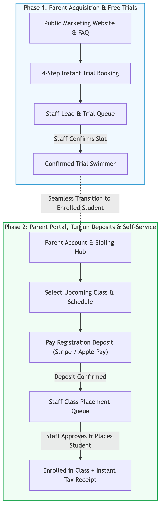
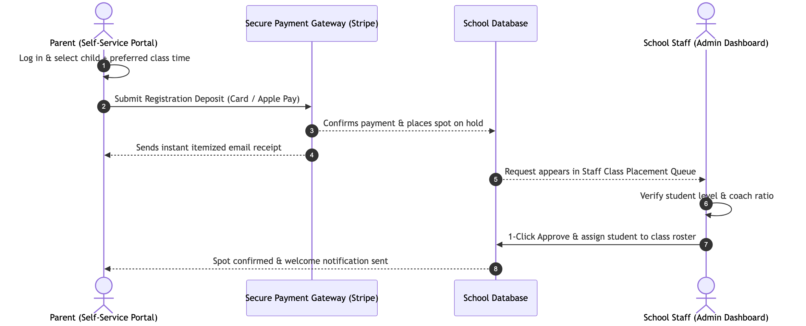

# Project Proposal: Swan Swim School Digital Growth Platform

**Client:** Swan Swim School  
**Document Version:** 2.2 (Business Scope, Commercials & Implementation Plan)  
**Status:** Proposal & Scope of Work  

---

## 1. Executive Summary & Business Objective

Swan Swim School is primed to capture growing family swim demand. However, manual phone calls, spreadsheet tracking, paper forms, and fragmented parent communication create administrative bottlenecks and lead drop-offs.

This project delivers a **complete, custom digital platform** designed to achieve three core business goals:

1. **Acquire New Families 24/7**: A fast, premium public website with instant trial lesson booking that turns website visitors into confirmed pool visits.
2. **Streamline Staff Operations & Reduce Admin Work**: A centralized staff hub that reduces manual administrative tasks by automating trial intakes, class placements, make-up credits, and parent notifications.
3. **Secure Revenue Upfront**: A self-service Parent Portal with deposit-backed registration via Apple Pay and credit card, ensuring committed enrollments and zero payment chasing.

To deliver immediate business value while maintaining smooth operations, the project is structured into **two strategic phases**:

* **Phase 1: High-Converting Marketing Website, Interactive Level Quiz, Pricing & Instant Trial Engine ($2,000)**  
  A modern, mobile-first brand website (6 dedicated pages including Curriculum, Pricing, Coach Bios, FAQ, and Facility), an interactive "Find Your Level" quiz, transparent tuition schedules, and a frictionless 4-step trial booking engine connected directly to the school's database.
* **Phase 2: Parent Portal, Online Deposits & Staff Operations Hub ($8,000)**  
  A dedicated portal allowing parents to manage all children under one account, book classes, submit registration deposits, and request make-ups—paired with centralized staff approval queues that automate roster updates and Stripe digital receipts.

{width=75%}

---

## 2. Phase 1: High-Converting Marketing Website & Trial Engine

### Business Objective
Create an authoritative, welcoming digital presence that builds immediate trust with parents, answers key questions upfront, and converts local search traffic into booked trial lessons around the clock.

### Deliverables & Key Inclusions

#### 1. Public Marketing Website (`apps/public`)
* **Homepage (`/`)**: High-impact brand hero, key differentiators (warm 88°F pool, 3:1 small class ratios, certified instructors), program showcases, coach highlights, parent testimonials, and prominent trial booking calls-to-action.
* **Programs & Curriculum (`/programs`)**: Transparent breakdown of skill tiers (Parent & Tot, Preschool Swimmers, Skill Builders, Advanced, Private Lessons) detailing age ranges, coach ratios, class durations, and learning milestones.
* **Transparent Pricing & Tuition List (`/programs` / Dedicated Pricing Section)**:
  * Clear, easy-to-read pricing matrix by program tier and class format (1:1 Private, 2:1 Semi-Private, 3:1 Small Group).
  * Monthly and semester tuition breakdowns, billing schedules, and registration details—eliminating price ambiguity and accelerating parent sign-up decisions.
* **Frequently Asked Questions Hub (`/faq`)**: Interactive, searchable FAQ portal answering top parent questions regarding readiness, pool temperature, what to bring, class ratios, deposits, and make-up policies—eliminating repetitive customer service phone calls.
* **About Us, Safe Facility & Coach Bios (`/about`)**:
  * School mission, facility safety standards, water sanitation protocols, and teaching philosophy.
  * **Coach Bios & Credentials Showcase**: Instructor profiles highlighting certifications (Lifeguard, CPR/AED, WSI), coaching backgrounds, specialties, and personal bios to establish deep trust with parents.
* **Contact & Operating Hours (`/contact`)**: Interactive location details, phone/email contact channels, and class schedules by day of the week.
* **Multi-Device Optimization**: Tailored, lightning-fast layouts across iPhone, Android, iPad, and desktop screens.

#### 2. Interactive "Find Your Level" Swim Quiz
* **Quick 30-Second Parent Assessment**:
  * Short, mobile-friendly 3–4 question evaluator asking about the child's age, comfort in water, floating/submersion skills, and stroke independence.
  * Instant, personalized program recommendation matching the child to the exact right swim level (e.g., Parent & Tot vs. Preschool vs. Skill Builder).
  * Direct 1-click handoff from quiz results into the trial booking engine with pre-filled level recommendations.

#### 3. Instant Trial Booking Engine (`/trial`)
* **Guided 4-Step Parent Experience**:
  1. *Parent Contact Information* (Name, phone, email)
  2. *Child Profile & Swim Level* (Name, age, swim comfort level)
  3. *Live Calendar Slot Picker* (Selects available open trial dates over the next 30 days)
  4. *Review & Instant Confirmation* (Summary card with instant submission confirmation)
* **Real-Time Capacity Check**: Automatically queries open pool slots to prevent overbooking trial spots.
* **Smart Lead Protection**: Built-in duplicate detection and spam filtering to ensure staff only review genuine family leads.

#### 4. Lead Management Backend Integration
* Direct pipeline routing every trial inquiry straight into the internal staff operations system for one-click confirmation and follow-up.

---

## 3. Phase 2: Parent Portal, Online Deposits & Staff Operations Hub

### Business Objective
Give parents a seamless self-service platform to manage their children's swim education while eliminating administrative friction for school staff through automated registration deposits, roster management, and digital receipts.

{width=80%}

### Deliverables & Key Inclusions

#### 1. Self-Service Parent Portal (`apps/public`)
* **Secure Family Account Management**: Easy, passwordless or email-based login allowing parents to manage multiple siblings under one family profile (birthdates, medical/allergy notes, swim history).
* **Deposit-Backed Class Registration**:
  * Parents browse upcoming term schedules and select their preferred day and time.
  * To guarantee commitment and prevent no-shows, parents **pay a registration deposit securely online**.
  * The spot is placed on hold and routed directly to staff for placement review.
* **Make-Up Request Engine**: Parents submit absence notifications and request eligible make-up sessions directly through the portal.
* **Automated Digital Receipts**: Instant itemized receipts are automatically emailed via Stripe upon transaction completion—providing parents with immediate records for childcare tax credits without staff involvement.

#### 2. Centralized Staff Operations Hub (`apps/web`)
* **Trial Lead Review & Conversion Queue**:
  * View pending trial requests with child ages and requested dates.
  * One-click session assignment that converts the trial into a confirmed booking.
* **Deposit-Verified Class Placement Queue**:
  * View incoming class registration requests with **confirmed deposit status**.
  * Review class capacity and coach ratios before confirming placement.
  * One-click approval that officially places the student on the active class roster.
* **Make-Up Class Scheduling Queue**:
  * Review student absence requests, verify eligibility, and assign to open matching slots with one click.

#### 3. Bank-Grade Payment Infrastructure (Stripe)
* Seamless acceptance of credit cards, debit cards, and Apple Pay / Google Pay.
* Real-time payment verification and automated reconciliation.
* Bank-grade encryption (PCI-DSS Level 1 compliance) keeping payment details 100% secure.

---

## 4. Market Value & Commercial Comparison

To provide clear commercial context, below is an industry comparison of what this complete custom software ecosystem typically costs when commissioned through a traditional digital agency versus the offered partner package:

| Project Scope / Component Area | Typical Agency Turnkey Pricing | Offered Partner Package | Direct Value & Savings |
| :--- | :---: | :---: | :---: |
| **Phase 1: Marketing Website, Level Quiz, Pricing & Trial Engine**\newline • Custom brand design system & 6 responsive pages\newline • Interactive 30-sec "Find Your Level" swim quiz\newline • Transparent tuition pricing schedule & coach bios\newline • Real-time 30-day dynamic trial booking engine\newline • Searchable FAQ portal & spam-protected lead routing | $5,000 – $6,500 | **$2,000** | **Save ~$3,500+ (60%+ off)** |
| **Phase 2: Parent Portal, Request Workflows & Stripe**\newline • Secure parent login & multi-child family hub\newline • Deposit-backed class registration & Stripe checkout\newline • Automated payment receipts & make-up request flow | $8,000 – $10,500 | **$4,500** | **Save ~$4,000+ (45%+ off)** |
| **Phase 2: Staff Operations Hub in Admin App**\newline • Centralized trial review & 1-click booking queue\newline • Deposit-verified enrollment & capacity management\newline • Make-up class assignment & full system testing | $5,000 – $7,000 | **$3,500** | **Save ~$2,500+ (40%+ off)** |
| **Total Platform Value** | **$18,000 – $24,000**\newline *(Typical Agency Avg: $20,000)* | **$10,000 Flat**\newline *(Phase 1: $2k + Phase 2: $8k)* | **Total Savings: ~$10,000**\newline *(50% Direct Savings)* |

**Fixed-Milestone Peace of Mind & Scope Flexibility**  
Unlike open-ended agency billing where costs inflate as details evolve, this project is delivered under a **guaranteed fixed price**. Minor workflow refinements, design tweaks, and natural iterations during development are accommodated within the milestone scope at no additional cost.

---

## 5. Investment & Transparent Milestone Schedule

### Milestone Breakdown

| Phase | Core Deliverables | Flat Investment |
| :--- | :--- | :---: |
| **Phase 1** | **Public Website, Level Quiz, Pricing, FAQ & Trial Lead Engine**\newline • 6 fully responsive pages (Home, Programs, About, FAQ, Contact, Trial)\newline • Interactive "Find Your Level" assessment quiz\newline • Transparent tuition pricing matrix & Coach bios showcase\newline • Dynamic 30-day live calendar trial booking system\newline • Searchable interactive FAQ with category filtering\newline • Backend APIs, lead routing & live production launch | **$2,000** |
| **Phase 2** | **Parent Portal, Deposit-Backed Registration & Staff Hub**\newline • Parent login & multi-child family profile hub\newline • Class schedule selection with Stripe deposit checkout\newline • Centralized staff review queues for trials, placements & make-ups\newline • Automated Stripe email receipts & end-to-end testing | **$8,000** |
| **Complete Platform** | **Full Digital Operating System** | **$10,000** |

---

### Payment Schedule

* **Phase 1 Payment Schedule ($2,000 Total):**
  * `50% ($1,000)` upon project kickoff and design review.
  * `50% ($1,000)` upon testing completion and live public launch.
* **Phase 2 Payment Schedule ($8,000 Total):**
  * `50% ($4,000)` upon Phase 2 kickoff and parent portal architecture review.
  * `50% ($4,000)` upon end-to-end payment verification and full operational release.

### Estimated Delivery Timeline

| Project Phase | Estimated Duration | Focus |
| :--- | :---: | :--- |
| **Phase 1: Public Website, FAQ & Trial Engine** | **~2 – 3 Weeks** | Brand design, 6 responsive pages, dynamic trial booking system, and live launch. |
| **Phase 2: Parent Portal, Deposits & Staff Hub** | **~10 – 12 Weeks** | Secure parent accounts, online deposit workflows, staff queues, and payment testing. |

*Note: Delivery timelines are good-faith estimates based on current scope and requirements, not strict guarantees or promises. Timelines may naturally shift depending on feedback turnaround, revision cycles, and development complexities.*

---

## 6. Hosting & Maintenance Fee

### Monthly Fee: **$200 / month**

To ensure fast loading speeds, 99.9% uptime, secure payment processing, and zero technical hassle for the school, this monthly fee covers:

* **Pro Cloud Hosting & Infrastructure**: Dedicated backend servers, edge CDN, database compute, and automated SSL certificates.
* **Automated Backups & Monitoring**: Daily database backups and 24/7 uptime monitoring to ensure zero data loss.
* **Ongoing Maintenance & Support**: Routine security patches, term/content updates, and priority technical support.

---

## 7. Client Responsibilities & Required Assets

To ensure timely delivery and maintain project momentum, the client is responsible for providing:

* **High-Resolution Brand Assets**: A high-quality vector/SVG logo file, brand color preferences, and any official graphic assets.
* **Page Content & Program Details**: Copy, descriptions, and specific information for the marketing pages (exact program tiers, term dates, tuition prices, facility details, instructor bios, operating hours, and location addresses).
* **Photography & Media**: High-resolution photos of the facility, pool deck, and coaching staff (placeholders will be used during early development if photography is in progress).
* **Timely Feedback & Approvals**: Prompt review and sign-off on design layouts and feature milestones to keep the project on track.

---

## 8. Project Authorization & Signatures

By signing below, both parties agree to the project scope, milestone investment schedule ($10,000 flat total: $2,000 for Phase 1, $8,000 for Phase 2), monthly hosting & maintenance fee ($200/mo upon Phase 1 launch), and responsibilities outlined in this document.

\vspace{0.5cm}

| **Client Authorization** | **Service Provider Authorization** |
| :--- | :--- |
| **Swan Swim School** | **Developer / Project Lead** |
| | |
| Signature: ___________________________ | Signature: ___________________________ |
| | |
| Printed Name: ________________________ | Printed Name: ________________________ |
| | |
| Title: _______________________________ | Title: _______________________________ |
| | |
| Date: ________________________________ | Date: ________________________________ |

