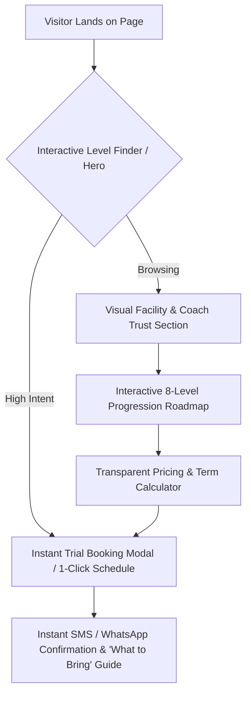

# Public Marketing Site (apps/public) 10/10 Upgrade Plan

This document outlines the strategic audit, core architectural pillars, and phased implementation roadmap to transform the **Swan Swim School** public marketing site (`apps/public`) into a high-converting, state-of-the-art marketing platform.

---

## 1. Executive Summary & Honest Audit

| Current State (~6/10) | Root Cause | Target 10/10 State |
| :--- | :--- | :--- |
| **Empty "Template" Vibe** | Heavy reliance on CSS gradients and Lucide vector icons; lack of authentic photography. | **Human Warmth & Facility Pride**: Real photography of happy swimmers, certified coaches, warm-water pools, viewing deck, and ribbon milestone ceremonies. |
| **Superficial Social Proof** | Static quotes with single-letter avatar circles. | **High-Converting Credibility**: Live Google Reviews badge (e.g., *4.9 ★★★★★ on 140+ reviews*), instructor credentials, and authentic parent testimonials with photos. |
| **Missing Facility Highlights** | Pool comfort details are omitted. | **Facility Tokens**: Clear callouts for **🌡️ 90°F Heated Water**, **💧 Advanced UV Water Filtration**, **👀 Glass Parent Viewing Deck**, and **🚿 Family Change Cabins**. |
| **Parent Placement Hesitation** | Parents do not know which level fits their child. | **Interactive Level Finder**: A 30-second guided questionnaire that recommends the exact program level and pre-populates trial booking. |
| **Pricing & Term Ambiguity** | No tuition guidelines or term calendar. | **Transparent Pricing & Value Matrix**: Clear breakdown of tuition tiers, sibling discounts, and make-up class policies. |
| **Booking Anxiety** | Parents are unsure what happens on trial day. | **"What to Expect on Trial Day"**: Step-by-step walkthrough detailing check-in, pool-side coaching, parent viewing, and placement reports. |

---

## 2. Strategic Conversion Flow

---

## 3. The 4 Core Pillars

### Pillar 1: Visual Excellence & Emotional Connection
* **Authentic Photography & Media**:
  * Replace placeholder icons and generic gradients with authentic, high-resolution imagery and subtle looping video accents.
  * Showcase warm indoor pools, children celebrating skill badges, and instructors actively coaching in the water.
* **Facility Highlights Bar**:
  * Feature key facility specs prominently across the homepage and location pages:
    * 🌡️ **90°F Warm Water** (essential for young children comfort).
    * 💧 **UV Sanitized & Low-Chlorine Filtration**.
    * 👀 **Glass Parent Viewing Lounge** with Wi-Fi.
    * 🚿 **Private Family Change Rooms & Showers**.
* **Coaching Staff Showcase**:
  * Instructor profiles featuring real headshots, aquatic certifications (Red Cross, Lifesaving Society, Swim Ontario, NCCP, Standard First Aid/CPR-C), and coaching philosophies.

### Pillar 2: Interactive Features That Convert
* **30-Second "Level & Program Matcher"**:
  * Interactive step-by-step quiz:
    1. Child's Age (e.g., 6 months–3 yrs, 3–5 yrs, 6–10 yrs, 10+ yrs).
    2. Water Comfort Level (e.g., afraid, comfortable blowing bubbles, swims independently).
    3. Stroke Experience (e.g., none, beginner freestyle, multi-stroke).
  * Outputs the recommended level with an instant button to **Book Free Trial for [Level]**.
* **Interactive 8-Level Skill Progression Roadmap**:
  * Visual timeline/slider detailing milestones from *Level 1: Water Discovery* through *Level 8: Competitive Prep & Medley*.
* **Interactive Location Switcher**:
  * Multi-location selector (Markham, Newmarket, Angus Glen Swim Team) with interactive Google Maps, transit/parking guidance, and real-time open trial slots.

### Pillar 3: Reducing Friction & Booking Anxiety
* **"Your First Day: What to Expect" Section (`/trial`)**:
  1. *Arrive 10 minutes early* — meet the front desk team.
  2. *Meet Your Instructor* — warm poolside greeting.
  3. *30-Minute Low-Pressure Assessment* — fun drills and comfort building.
  4. *Personalized Progress Report* — receive an immediate level recommendation and registration options.
* **Categorized FAQ Accordion**:
  * Searchable/filterable FAQ categories: *Trial Bookings*, *Tuition & Sibling Discounts*, *Cancellation & Make-Up Policies*, *Facility & Water Safety*.
* **Fast Multi-Channel Inquiries**:
  * Sticky WhatsApp / SMS / WeChat quick-inquiry floating widget optimized for York Region (Markham, Richmond Hill, Newmarket) families.

### Pillar 4: Local SEO & Social Authority
* **Google Reviews Widget**:
  * Verified reviews carousel with Google badge integration, parent names, swimmer ages, and review dates.
* **Structured Data & Local SEO**:
  * `LocalBusiness` / `SportsClub` JSON-LD schema with precise geo-coordinates, operating hours, and service areas.
  * Local landing pages targeting key search keywords (*"Kids Swim Lessons Markham"*, *"Toddler Swimming Lessons Newmarket"*, *"Private Swim Coaching York Region"*).

---

## 4. Phased Implementation Roadmap

### Phase 1: High-Impact Visuals & Trust Foundation (COMPLETED)
- [x] Curate and integrate high-resolution pool and coaching photography placeholders.
- [x] Deploy the **Facility Highlights Bar** on the Homepage Hero.
- [x] Add the **Verified Google Reviews / Testimonials Widget** with parent avatars and location badges.
- [x] Implement the **"What to Expect on Trial Day"** component on `/trial`.
- [x] Implement the **Coach Showcase ("Meet Our Certified Instructors")** component.
- [x] Implement the **Facility Photo Gallery** component.
- [x] Upgrade **Programs (`/programs`)** and **About (`/about`)** pages with rich visual curriculum headers.

### Phase 2: Interactive Conversion Tools (Week 2)
- [ ] Build and launch the **30-Second Level Matcher Quiz** on `/programs` and `/trial`.
- [ ] Build the **8-Level Skill Progression Roadmap** interactive visual component.
- [ ] Embed interactive Google Maps and facility guides on `/contact` and location cards.
- [ ] Add the floating Quick-Contact Widget (WhatsApp / SMS / WeChat).

### Phase 3: Transparency & Local SEO Optimization (Week 3)
- [ ] Add structured **Tuition & Sibling Discount Breakdown** cards.
- [ ] Implement `LocalBusiness` JSON-LD structured schema on all public routes.
- [ ] Add local SEO metadata for Markham, Newmarket, and surrounding York Region areas.
- [ ] Set up end-to-end conversion tracking (Google Analytics 4 & Meta Pixel event hooks for trial submissions).
